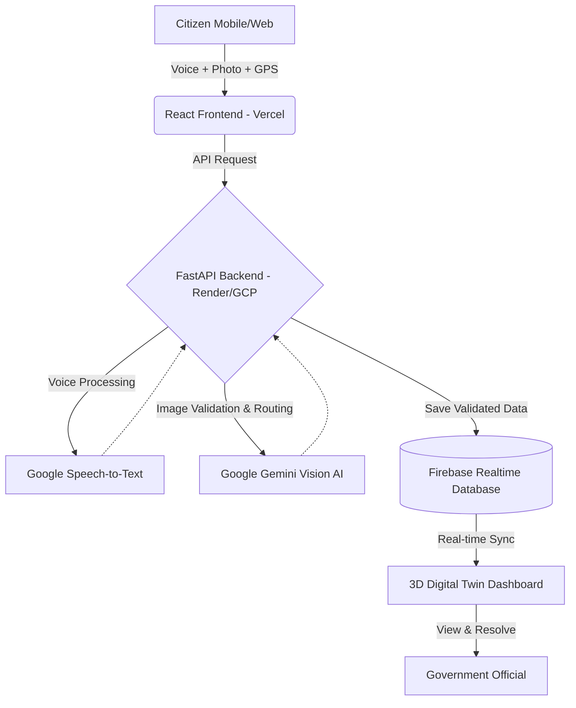

# JanDhwani: Voice-First 3D Grievance Gateway

**JanDhwani (जन-ध्वनि)** is a next-generation civic grievance redressal platform designed to bridge the digital divide in India. It empowers citizens—especially in rural and semi-urban areas—to report local issues (like water leakage, broken roads, or power outages) using their native language voice and live photos, completely eliminating the need for complex typing or forms.

---

## 1. Tech Stack (टेक्नोलॉजी)
The project is built on a modern, scalable, and fully free (or free-tier) tech stack, primarily relying on Google's ecosystem.

| Component | Technology Used | Purpose |
| :--- | :--- | :--- |
| **Frontend (UI/UX)** | React.js, Vite, Vanilla CSS | Fast, responsive, glassmorphism-based User Interface. |
| **Backend (API)** | Python, FastAPI | High-performance backend to handle AI processing and routing. |
| **Database** | Firebase Realtime Database | Fast, NoSQL cloud database for real-time syncing of grievances. |
| **AI & Machine Learning** | Google Gemini Vision, Google Speech-to-Text | Validating images for fraud, categorizing issues, and transcribing native voice. |
| **Deployment** | Vercel (Frontend), Render / Google Cloud Run (Backend) | CI/CD automated deployments linked directly to GitHub. |

---

## 2. Novelty & Innovation (नया क्या है?)
JanDhwani introduces several first-of-its-kind features in civic tech:
- **Voice-First Multilingual Input:** Users don't need to type. They just click a button and speak in Hindi, Marathi, Tamil, or English.
- **AI-Powered Anti-Fraud System:** The system uses Gemini Vision to scan uploaded photos to ensure they are real. It detects if a photo is a downloaded internet image or a screenshot, preventing fake spam complaints.
- **Smart GPS Tagging:** Live camera captures automatically embed exact GPS coordinates to the complaint, eliminating fake location entries.
- **3D Digital Twin Visualization:** Complaints are not just stored in boring tables. They are plotted on a 3D interactive map (Digital Twin) for government officials to visualize issue hotspots in real-time.
- **Automated AI Routing:** The AI automatically understands the voice complaint, assigns a "Severity Level" (e.g., High, Moderate), and routes it to the correct department (e.g., Jal Shakti, MSEDCL).

---

## 3. Real-World Impact (प्रभाव)
- **Digital Inclusion:** Empowers illiterate or less tech-savvy citizens to report issues easily using voice.
- **Time Efficiency:** Reduces the grievance registration time from 10 minutes (filling forms) to under 30 seconds.
- **Resource Optimization for Gov:** AI auto-categorization saves thousands of manual hours for government workers who previously had to read and sort complaints.
- **Transparency & Trust:** The 3D Digital Twin creates a public, transparent record of what is broken and what has been fixed.

---

## 4. System Architecture (आर्किटेक्चर)

---

## 5. Workflow (काम कैसे करता है?)

**Step 1: Onboarding & Authentication**
- The citizen logs into the portal and their state/district is registered.

**Step 2: Multimodal Capture (The Core Action)**
- The citizen selects their language and clicks the Mic button to speak their problem.
- They click a live photo of the issue. The system captures their exact GPS location in the background.

**Step 3: AI Processing (Backend Magic)**
- The voice is transcribed into text.
- The photo is sent to Google Gemini Vision, which verifies that the photo matches the spoken text and is not a fake downloaded image.
- Gemini automatically assigns a category (e.g., Water Supply, Electricity) and calculates a severity score.

**Step 4: Database & Visualization**
- The verified complaint is saved to Google Firebase.
- The complaint instantly pops up as a glowing red marker on the **3D Digital Twin Map**.

**Step 5: Resolution**
- Government officials view the 3D map, see the exact GPS location and AI summary, and dispatch a team. Once fixed, it moves to the "Resolved Archive".
